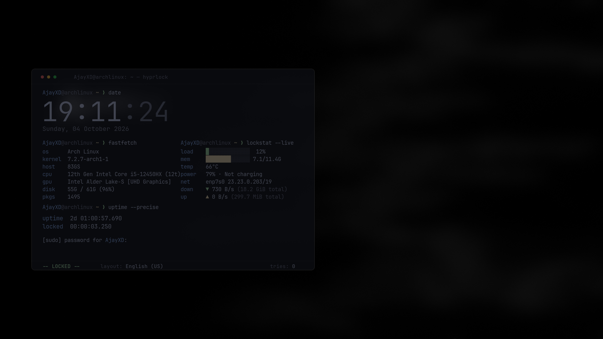

<h1 align="center">kyber</h1>
<p align="center"><i>a terminal-style lock screen for <a href="https://github.com/hyprwm/hyprlock">hyprlock</a></i></p>

<p align="center">
  
</p>
<!-- TODO: add docs/screenshot.png before publishing -->

kyber turns your lock screen into a terminal window that doubles as a small
system dashboard:

- **clock and date** in a large light font
- **system specs**: OS, kernel, host, CPU, GPU, disk, package count
- **live stats** (1 s refresh): CPU load and memory bars, temperature, battery,
  network interface, IP, and live download/upload speed with totals
- **precise uptime** and **time spent locked**, down to the millisecond
- a **`[sudo] password`** prompt that reports failed attempts like sudo does
- a vim-style status bar with your keyboard layout and attempt count
- five palettes, three background modes, and privacy toggles

It is a theme plus a small bash script. There are no daemons and no dependencies
beyond tools that ship with any Linux system.

## Requirements

| | |
|---|---|
| required | `hyprlock`, `bash` 5+, `iproute2`, `awk`, `sed`, `procps` (for `pgrep`), `findutils`, `coreutils` |
| recommended | [JetBrains Mono Nerd Font](https://www.nerdfonts.com/) (Arch: `ttf-jetbrains-mono-nerd`) |
| optional | `pciutils` (GPU name), `fontconfig` (font check in `kyber doctor`) |

<!-- TODO: add "Tested with" (hyprlock version, distro, resolution) once you have tried it -->

## Install

### Arch Linux (AUR)

```sh
yay -S kyber-hyprlock      # once published
```

### From source

```sh
git clone https://github.com/AjayXD/kyber
cd kyber
./install.sh               # installs to ~/.local and generates the theme
```

System-wide instead: `sudo make install PREFIX=/usr`.
Remove with `./uninstall.sh` (or `sudo make uninstall PREFIX=/usr`).

## Use

```sh
kyber doctor     # check dependencies and fonts
kyber lock       # lock the screen with the kyber theme
```

**Keep a spare TTY open the first time** (Ctrl+Alt+F3). See
[If something goes wrong](#if-something-goes-wrong).

`kyber lock` regenerates the theme from your settings on every run, so edits to
the config apply immediately.

### Make it your default lock screen

Either call `kyber lock` wherever you lock, for example in `hypridle.conf`:

```ini
general {
    lock_cmd = pidof hyprlock || /path/to/kyber lock
    before_sleep_cmd = loginctl lock-session
}
```

and in `hyprland.conf`:

```ini
bind = SUPER, L, exec, /path/to/kyber lock
```

(use the full path from `command -v kyber`; your compositor session may not have
`~/.local/bin` in its `PATH`), or install the generated theme as
hyprlock's own config:

```sh
kyber apply --default      # backs up your existing hyprlock.conf first
```

After changing settings, run `kyber apply --default` again.

## Configure

```sh
$EDITOR "$(kyber config)"     # creates ~/.config/kyber/config if missing
```

| setting | default | what it does |
|---|---|---|
| `PALETTE` | `catppuccin` | `catppuccin`, `gruvbox`, `nord`, `tokyo-night`, `dracula` |
| `FONT`, `FONT_THIN` | JetBrainsMono Nerd Font (+ Light) | any installed monospace font; `FONT_THIN` is for the clock |
| `CLOCK_24H` | `1` | `0` for 12-hour with AM/PM |
| `TEXT_DOTS` | `1` | `*` per typed character; set `0` on older hyprlock versions |
| `BACKGROUND` | `screenshot` | `screenshot`, `image`, `slideshow`, or `color` |
| `WALLPAPER` | empty | image path (`image`) or folder (`slideshow`) |
| `SLIDESHOW_INTERVAL` | `15` | seconds between slideshow images (whole seconds) |
| `BLUR`, `BRIGHTNESS` | `3`, `0.5` | blur passes 0-4, brightness 0.0-1.0 |
| `MILLISECONDS` | `1` | `0` shows whole seconds and refreshes once a second (lighter) |
| `NET_IFACE` | auto | force a network interface |
| `HIDE_HOST` | `0` | hide hostname and machine model |
| `HIDE_IP` | `0` | hide your IP address |
| `HIDE_NETWORK` | `0` | hide the network rows entirely |

### Backgrounds

- **screenshot** blurs a snapshot of your desktop and needs no files.
- **image** uses one picture: `BACKGROUND=image`, `WALLPAPER=~/Pictures/wall.png`.
- **slideshow** crossfades through a folder (`jpg`, `png`, `webp`) using
  hyprlock's background reload feature. A random image is chosen each time and
  never the same twice in a row.
- **color** fills with the palette's window color.

hyprlock cannot play GIFs or video natively, and kyber does not try to.

### Privacy

A lock screen is visible to anyone walking past. If you lock in shared spaces,
consider `HIDE_HOST=1`, `HIDE_IP=1` or `HIDE_NETWORK=1`.

## How it works

`kyber apply` renders `share/kyber/hyprlock.conf.in` into
`~/.config/kyber/hyprlock.conf`, filling in your palette, fonts and background.
The live panels are hyprlock `label` widgets using `cmd[update:N]`, which re-run
`kyber feed <name>` on a timer:

| feed | refresh | reads |
|---|---|---|
| `clock` | 1 s | bash builtin time |
| `sys` | 10 s | `/etc/os-release`, `/proc/cpuinfo`, `lspci`, `df`, package manager |
| `live` | 1 s | `/proc/stat`, `/proc/meminfo`, hwmon / thermal zones, power supply, `/sys/class/net` |
| `uptime` | 100 ms (1 s with `MILLISECONDS=0`) | `/proc/uptime`, hyprlock's `/proc/<pid>/stat` |

CPU load and network speed are deltas, so each call keeps the previous counters
in `$XDG_RUNTIME_DIR`.

## Notes and limitations

- **Millisecond display:** the kernel reports uptime in 10 ms steps, so the last
  digit is always 0.
- **Layout is pixel-based:** the window is 900x640, anchored 100 px from the
  left edge, and tuned for 1080p. On other resolutions or scale factors, adjust the
  `position` and `size` values in `share/kyber/hyprlock.conf.in`.
- **Failed attempts on Arch:** by default hyprlock goes through `pam_faillock`,
  which locks you out for 10 minutes after 3 failed unlocks. That is a PAM
  setting, not kyber.
- **Cost:** the 100 ms uptime feed starts a small process ten times a second
  while locked. Set `MILLISECONDS=0` on battery if you care.
- **Package count** supports pacman, dpkg and rpm; other systems show `n/a`.

## If something goes wrong

Test with `kyber lock` from a terminal so you can see hyprlock's output. If the
screen stays black or shows an error and you can't unlock:

1. Switch to a TTY (Ctrl+Alt+F3) and log in.
2. Run:
   ```sh
   hyprctl --instance 0 'keyword misc:allow_session_lock_restore 1'
   hyprctl --instance 0 'dispatch exec hyprlock'
   ```
3. Unlock, then run `kyber doctor` and check the output of `kyber lock`.

Common causes: a missing font (shows wrong glyphs), a hyprlock too old for
`dots_text_format` (set `TEXT_DOTS=0`), or labels that stay empty because
`kyber` has moved since the theme was generated (run `kyber apply` again).

## Contributing

Issues and pull requests are welcome, especially for new palettes, more
distro package managers, and layout fixes for other resolutions. Please include
your hyprlock version and a screenshot.

## Credits and license

MIT, see [LICENSE](LICENSE). Palettes are based on
[Catppuccin](https://github.com/catppuccin/catppuccin), Gruvbox, Nord, Tokyo
Night and Dracula. Fonts are not bundled.
